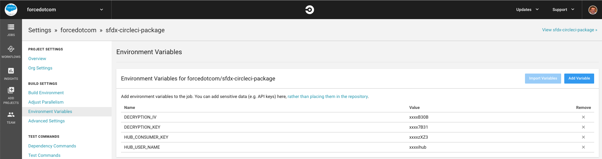

# Salesforce App

This guide helps Salesforce developers who are new to Visual Studio Code go from zero to a deployed app using Salesforce Extensions for VS Code and Salesforce CLI.

## Part 1: Choosing a Development Model

There are two types of developer processes or models supported in Salesforce Extensions for VS Code and Salesforce CLI. These models are explained below. Each model offers pros and cons and is fully supported.

### Package Development Model

The package development model allows you to create self-contained applications or libraries that are deployed to your org as a single package. These packages are typically developed against source-tracked orgs called scratch orgs. This development model is geared toward a more modern type of software development process that uses org source tracking, source control, and continuous integration and deployment.

If you are starting a new project, we recommend that you consider the package development model. To start developing with this model in Visual Studio Code, see [Package Development Model with VS Code](https://forcedotcom.github.io/salesforcedx-vscode/articles/user-guide/package-development-model). For details about the model, see the [Package Development Model](https://trailhead.salesforce.com/en/content/learn/modules/sfdx_dev_model) Trailhead module.

If you are developing against scratch orgs, use the command `SFDX: Create Project` (VS Code) or `sfdx force:project:create` (Salesforce CLI)  to create your project. If you used another command, you might want to start over with that command.

When working with source-tracked orgs, use the commands `SFDX: Push Source to Org` (VS Code) or `sfdx force:source:push` (Salesforce CLI) and `SFDX: Pull Source from Org` (VS Code) or `sfdx force:source:pull` (Salesforce CLI). Do not use the `Retrieve` and `Deploy` commands with scratch orgs.

### Org Development Model

The org development model allows you to connect directly to a non-source-tracked org (sandbox, Developer Edition (DE) org, Trailhead Playground, or even a production org) to retrieve and deploy code directly. This model is similar to the type of development you have done in the past using tools such as Force.com IDE or MavensMate.

To start developing with this model in Visual Studio Code, see [Org Development Model with VS Code](https://forcedotcom.github.io/salesforcedx-vscode/articles/user-guide/org-development-model). For details about the model, see the [Org Development Model](https://trailhead.salesforce.com/content/learn/modules/org-development-model) Trailhead module.

If you are developing against non-source-tracked orgs, use the command `SFDX: Create Project with Manifest` (VS Code) or `sfdx force:project:create --manifest` (Salesforce CLI) to create your project. If you used another command, you might want to start over with this command to create a Salesforce DX project.

When working with non-source-tracked orgs, use the commands `SFDX: Deploy Source to Org` (VS Code) or `sfdx force:source:deploy` (Salesforce CLI) and `SFDX: Retrieve Source from Org` (VS Code) or `sfdx force:source:retrieve` (Salesforce CLI). The `Push` and `Pull` commands work only on orgs with source tracking (scratch orgs).

## The `sfdx-project.json` File

The `sfdx-project.json` file contains useful configuration information for your project. See [Salesforce DX Project Configuration](https://developer.salesforce.com/docs/atlas.en-us.sfdx_dev.meta/sfdx_dev/sfdx_dev_ws_config.htm) in the _Salesforce DX Developer Guide_ for details about this file.

The most important parts of this file for getting started are the `sfdcLoginUrl` and `packageDirectories` properties.

The `sfdcLoginUrl` specifies the default login URL to use when authorizing an org.

The `packageDirectories` filepath tells VS Code and Salesforce CLI where the metadata files for your project are stored. You need at least one package directory set in your file. The default setting is shown below. If you set the value of the `packageDirectories` property called `path` to `force-app`, by default your metadata goes in the `force-app` directory. If you want to change that directory to something like `src`, simply change the `path` value and make sure the directory you’re pointing to exists.

```json
"packageDirectories" : [
    {
      "path": "force-app",
      "default": true
    }
]
```

## Part 2: Working with Source

For details about developing against scratch orgs, see the [Package Development Model](https://trailhead.salesforce.com/en/content/learn/modules/sfdx_dev_model) module on Trailhead or [Package Development Model with VS Code](https://forcedotcom.github.io/salesforcedx-vscode/articles/user-guide/package-development-model).

For details about developing against orgs that don’t have source tracking, see the [Org Development Model](https://trailhead.salesforce.com/content/learn/modules/org-development-model) module on Trailhead or [Org Development Model with VS Code](https://forcedotcom.github.io/salesforcedx-vscode/articles/user-guide/org-development-model).

## Part 3: Deploying to Production

Don’t deploy your code to production directly from Visual Studio Code. The deploy and retrieve commands do not support transactional operations, which means that a deployment can fail in a partial state. Also, the deploy and retrieve commands don’t run the tests needed for production deployments. The push and pull commands are disabled for orgs that don’t have source tracking, including production orgs.

Deploy your changes to production using [packaging](https://developer.salesforce.com/docs/atlas.en-us.sfdx_dev.meta/sfdx_dev/sfdx_dev_dev2gp.htm) or by [converting your source](https://developer.salesforce.com/docs/atlas.en-us.sfdx_cli_reference.meta/sfdx_cli_reference/cli_reference_force_source.htm#cli_reference_convert) into metadata format and using the [metadata deploy command](https://developer.salesforce.com/docs/atlas.en-us.sfdx_cli_reference.meta/sfdx_cli_reference/cli_reference_force_mdapi.htm#cli_reference_deploy).
# sfdx-circleci-package
[](https://circleci.com/gh/forcedotcom/sfdx-circleci-package)

For a fully guided walkthrough of setting up and configuring continuous integration using scratch orgs and Salesforce CLI, see the [Continuous Integration Using Salesforce DX](https://trailhead.salesforce.com/modules/sfdx_travis_ci) Trailhead module using Travis CI.

This repository shows one way you can successfully use Salesforce CLI to create new package versions with CircleCI. We make a few assumptions in this README. Continue only if you have completed these critical configuration prerequisites.

- You know how to set up your Github repository with CircleCI. (Here's their [Getting Started guide](https://circleci.com/docs/2.0/).)
- You have properly set up the JWT-based authorization flow (headless). We recommend using [these steps for generating your Self-Signed SSL Certificate](https://devcenter.heroku.com/articles/ssl-certificate-self).

## Getting Started
1) [Fork](http://help.github.com/fork-a-repo/) this repo in to your GitHub account using the fork link at the top of the page.

2) Clone your forked repo locally: `git clone https://github.com/<git_username>/sfdx-circleci-package.git`

3) Make sure that you have Salesforce CLI installed. Run `sfdx force --help` and confirm you see the command output. If you don't have it installed, you can download and install it from [here](https://developer.salesforce.com/tools/sfdxcli).

4) Set up a JWT-based auth flow for the target orgs that you want to deploy to. This step creates a `server.key` file that is used in subsequent steps.
(https://developer.salesforce.com/docs/atlas.en-us.sfdx_dev.meta/sfdx_dev/sfdx_dev_auth_jwt_flow.htm)

5) Confirm that you can perform a JWT-based auth: `sfdx force:auth:jwt:grant --clientid <your_consumer_key> --jwtkeyfile server.key --username <your_username> --setdefaultdevhubusername`

   **Note:** For more info on setting up JWT-based auth, see [Authorize an Org Using the JWT-Based Flow](https://developer.salesforce.com/docs/atlas.en-us.sfdx_dev.meta/sfdx_dev/sfdx_dev_auth_jwt_flow.htm) in the [Salesforce DX Developer Guide](https://developer.salesforce.com/docs/atlas.en-us.sfdx_dev.meta/sfdx_dev).

6) Encrypt and store the generated `server.key` using the instructions below.  IMPORTANT! For security reasons, don't store the `server.key` within the project.
> "CircleCI does a nice job of allowing you to set environment variables inside the UI in a protected way." (attribution to [Kevin O'Hara](https://github.com/kevinohara80))

- First, generate a key and initializtion vector (iv) to encrypt your `server.key` file locally.  CircleCI uses the key and iv to decrypt your server key in the build environment.

```bash
$ openssl enc -aes-256-cbc -k <passphrase here> -P -md sha1 -nosalt
  key=E5E9FA1BA31ECD1AE84F75CAAA474F3A663F05F412028F81DA65D26EE56424B2
  iv =E93DA465B309C53FEC5FF93C9637DA58
```

> Make note of the `key` and `iv` values output to the screen. You'll use the values following `key=` and `iv =` to encrypt your `server.key` in the next step.

- Encrypt the `server.key` using the newly generated `key` and `iv` values.  The `key` and `iv` values *should* only be used once, don't use them to encrypt more than the `server.key`.  While you can re-use this pair to encrypt other things, it is considered a security violation to do so.  Every time you run the command above, a new `key` and `iv` value will be generated.  IE, you can not regenerated the same pair, so if you lose these values you will need to generated new ones and encrypt again.

```bash
openssl enc -nosalt -aes-256-cbc -in assets/server.key -out assets/server.key.enc -base64 -K <key from above> -iv <iv from above>
```
 This command replaces the existing `server.key.enc` with your encrypted version.

- Store the `key`, and `iv` as protected environment variables in the CircleCI UI. These valus are considered *secret* so please treat them as such.

7) From your JWT-based connected app on Salesforce, retrieve the generated `Consumer Key` from your Dev Hub org.

8) Set your `Consumer Key` in a CircleCI environment variable named `HUB_CONSUMER_KEY` using the CircleCI UI. Set your `Username` in a CircleCI environment variable named `HUB_USER_NAME` using the CircleCI UI.  This username is the username that you use to access your Dev Hub.

9) Store the `key` and `iv` values used above in CircleCI environment variables named `DECRYPTION_KEY` and `DECRYPTION_IV`, respectively. When finished setting environment variables, your environment variables setup screen should look like the one below.



10) Copy all the contents of `package-sfdx-project.json` into `sfdx-project.json` and save.

11) Create the sample package. Run: `sfdx force:package:create --path force-app/main/default/ --name "CircleCI" --description "Circle CI Package Example" --packagetype Unlocked`

12) Create the first package version: `sfdx force:package:version:create --package "CircleCI" --installationkeybypass --wait 10 --json --targetdevhubusername HubOrg`

13) In the `config.yml`, update the value in the `PACKAGENAME` variable to be the Package Id in your `sfdx-project.json` file.  This ID starts with `0Ho`.

14) Commit the updated `sfdx-project.json`,`config.yml`, and `server.key.enc` files.

Now you're ready to go! When you commit and push a change, your change kicks off a CircleCI build.

Enjoy!

## Contributing to the Repository ###

If you find any issues or opportunities for improving this repository, fix them! Feel free to contribute to this project by [forking](http://help.github.com/fork-a-repo/) this repository and making changes to the content. Once you've made your changes, share them back with the community by sending a pull request. See [How to send pull requests](http://help.github.com/send-pull-requests/) for more information about contributing to Github projects.

## Reporting Issues ###

If you find any issues with this demo that you can't fix, feel free to report them in the [issues](https://github.com/forcedotcom/sfdx-circleci-package/issues) section of this repository.
